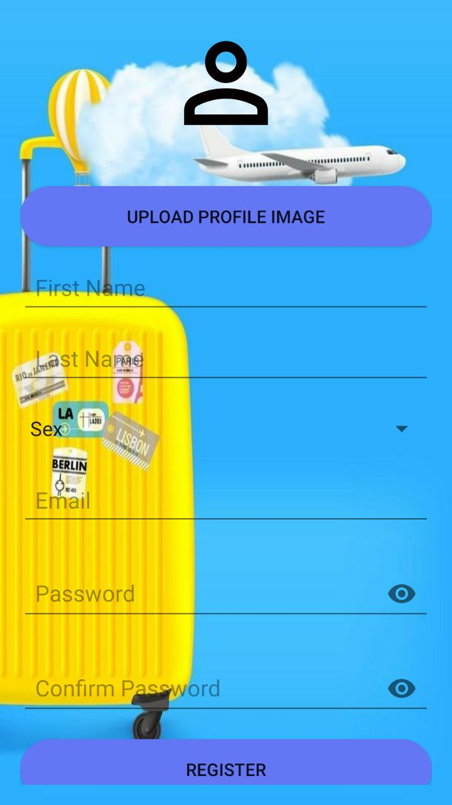
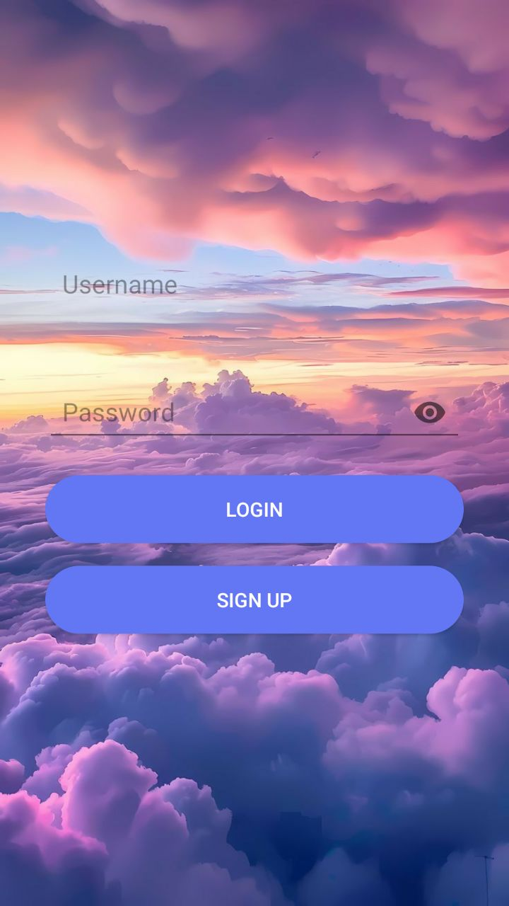
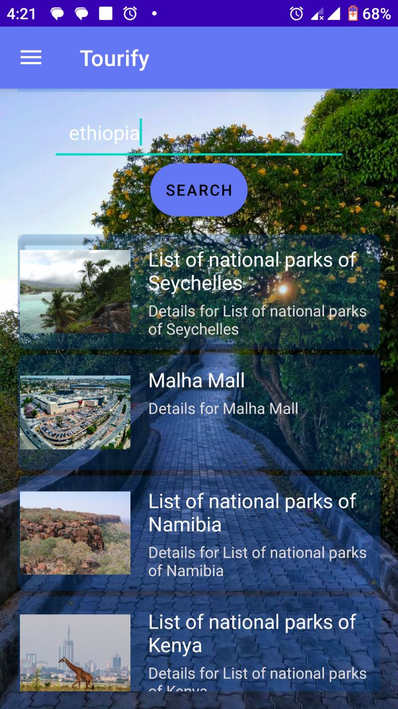
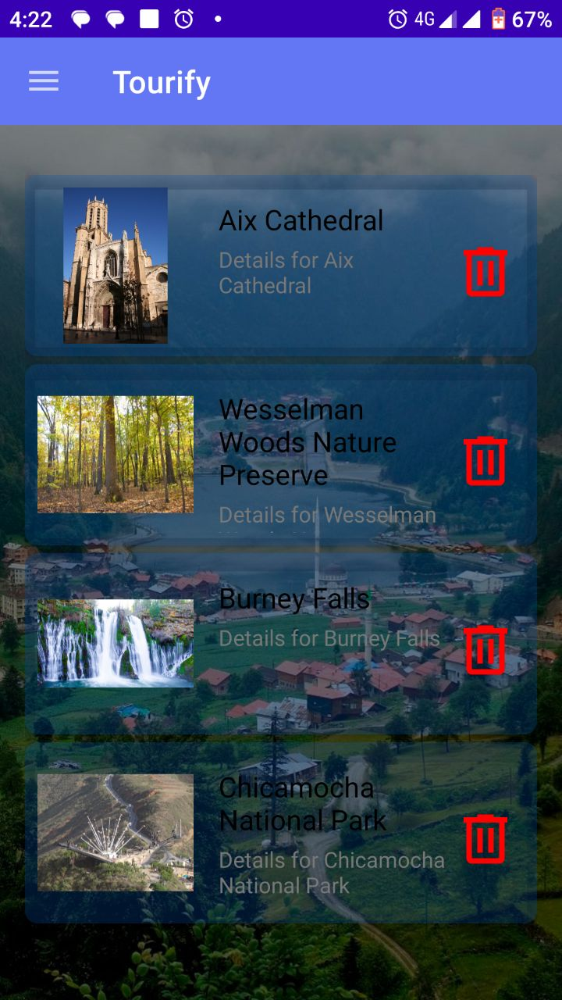
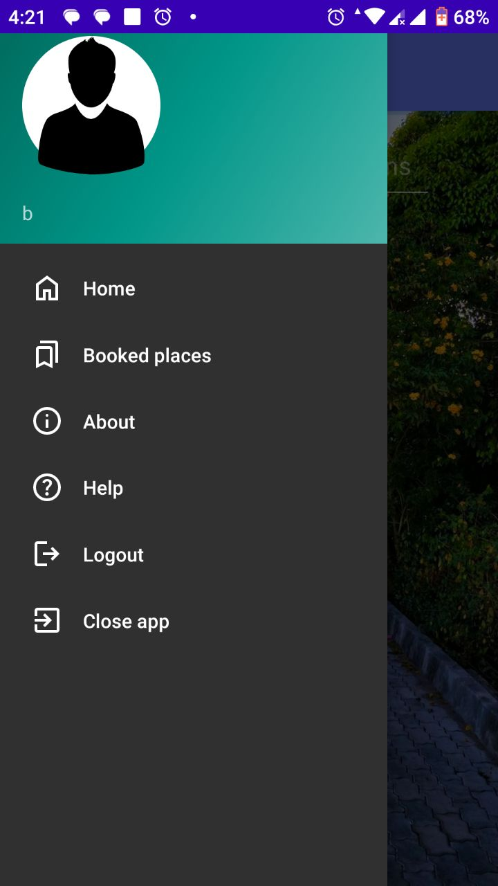

# Tourify

Tourify is a mobile application that helps users discover tourist attractions and natural sites, plan visits, and make bookings directly from their phones. With a vast collection of places to explore, Tourify provides detailed information, photos, and booking functionality, all powered by Firebase for real-time updates.

## Features

- **Explore Tourist Attractions:** Discover various tourist spots and natural sites.
- **Search Functionality:** Search attractions based on location, type, and category.
- **Booking System:** Make reservations for tickets directly through the app.
- **User Profile Management:** Manage personal details and check booking history.
- **Real-Time Data with Firebase:** All data is synced in real-time, powered by Firebase.
- **Clean & Interactive UI:** Enjoy a user-friendly interface with smooth navigation.
- **Images & Details:** View detailed descriptions, images, and user ratings of the attractions.

## Installation

To get started with Tourify, follow these steps:

1. **Clone the repository:**
   ```
   https://github.com/BESUFKADMEKONNEN/Tourify.git
   ```

2. **Navigate to the project directory:**
   ```
   cd tourify
   ```

3. **Install dependencies:**
   Ensure you have Android Studio installed. Then, open the project and build it.

4. **Running the App:**
   - Open the project in Android Studio.
   - Run the app on your emulator or Android device.

5. **Firebase Setup:**
   Ensure that Firebase is properly set up in your project. Follow the Firebase configuration steps to enable authentication, real-time database, and any other Firebase services you may be using.

6. **Permissions:**
   Make sure you have the necessary permissions configured for internet and storage access in your app.

## Usage

- **Sign Up/Log In:** Users must sign up or log in to the app to begin exploring tourist destinations.
- **Search Attractions:** Use the search feature to find tourist spots by category or location.
- **View Details:** Tap on an attraction to view detailed information, photos, and ratings.
- **Book Tickets:** Once you've chosen an attraction, follow the booking process to confirm your reservation.

## Screenshots

Here are some screenshots of the app:

## Registration Screen
   
  

  
## Login Screen
   
 

 
## Home Screen
  
 

   
## Booked Attractions

 

   
## Navigation Screen
  
 

   
## User Profile
  
 


## License

This project is licensed under the MIT License.

## Author

Besufkad Mekonnen

